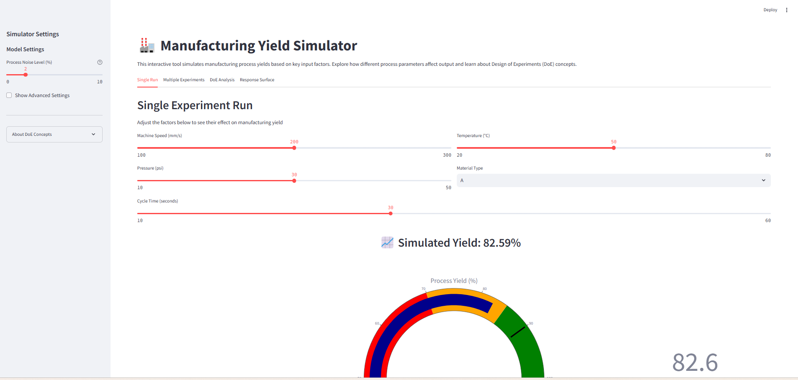

# 🏭 Manufacturing Yield DoE Simulator

## Overview
This interactive web application simulates manufacturing process yields based on key input factors. It helps users explore and understand Design of Experiments (DoE) concepts like main effects, interactions, and noise in a manufacturing context. 

## Features

### 1. Interactive Process Simulation
- Adjust machine speed, pressure, temperature, material type, and cycle time parameters
- Observe real-time yield predictions with detailed breakdown of factor contributions
- Visual gauge chart for quick yield assessment

### 2. Multiple Experiment Capabilities
- Run batches of experiments with different sampling strategies:
  - Random sampling (uniform or normal distribution)
  - Grid-based exploration
  - Standard DoE designs (full factorial and fractional factorial)
- Visualize results through 3D plots, heatmaps, and box plots
- Export experiment data for further analysis in other tools

### 3. DoE Analysis Tools
- Main effects plots showing how individual factors affect yield
- Interaction plots revealing how factors work together
- Statistical significance testing with p-value reporting
- Pareto charts to identify the most important factors

### 4. Response Surface Methodology
- 3D response surface visualization
- 2D contour plots for identifying optimal regions
- Automated optimal settings finder to maximize yield

## Installation

### Prerequisites
- Python 3.8 or higher
- Pip package manager

### Setup
1. Clone or download this repository
2. Install the required packages:
   ```
   pip install -r requirements.txt
   ```

## Usage

### Starting the Application
1. Open a command prompt or terminal
2. Navigate to the project directory
3. Run the application using one of these methods:
   - Double-click the `streamlit run main.bat` file (Windows)
   - Run `streamlit run main.py` in your terminal

### Using the Simulator
1. **Single Run Mode**: Adjust sliders to see how each parameter affects yield
2. **Multiple Experiments**: Configure and run batches of experiments to generate data
3. **DoE Analysis**: Analyze results to understand factor effects and interactions
4. **Response Surface**: Explore optimal settings for your manufacturing process

## Educational Value
This simulator serves as an educational tool for:
- Learning DoE principles in a manufacturing context
- Understanding how process parameters interact to affect yield
- Visualizing complex statistical concepts
- Exploring response surface methodology for process optimization

## For Advanced Users
- Adjust model coefficients in the sidebar's advanced settings
- Modify noise levels to simulate different process variabilities
- Export data for further analysis in statistical software

## About Design of Experiments (DoE)
Design of Experiments is a systematic approach to determining the relationship between factors affecting a process and the output of that process. Key concepts demonstrated in this simulator:

- **Main Effects**: The direct effect of changing one factor on the response
- **Interactions**: When the effect of one factor depends on the level of another
- **Response Surface**: Visualizing how factors combine to affect the response
- **Noise**: Random variation in the process that can't be controlled

## Version Information
- Version: 1.0 (April 2025)
- Developed by: Andy Leong